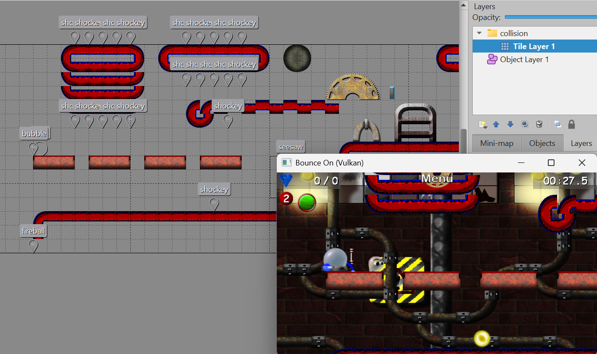
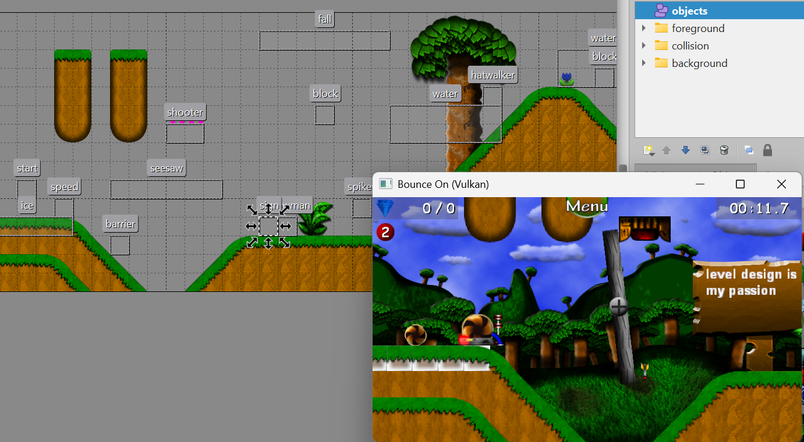

# TMX2MAP
A utility to convert Tiled projects into Bounce On MAP files.

Current version: 1.0

# Demonstration



# TODO
- Overworld support.
- Other missing object types.
- Platforms.
- Parallax background images.
- Support for more tile layer formats.

# Requirements
- Python.

# How to use

## Tileset
Levels use tiles of size 32x32. Tilesets can be found in the game folder `Content/Textures/Tilesets`.

## Structure
Bounce On levels are composed of 3 types of layers:
- **Background** - These layers are decorative and behind the game objects and player. They are optional.
- **Collision** - These layers store objects that the player can interact with, that is, solids and gems. At least one is mandatory.
- **Foreground** - These layers are decorative and in front of the game objects and player. They are optional.

The Tiled project must be of a fixed size and use Gzip compression.
To change the compression format to Gzip, go to `Map > Map Properties...` and change the property "Tile Layer Format" to "Base64 (gzip compressed)".

The project should be structured like this:


The actual order of the groups and root layers in the project does not matter, and the background and foreground groups are optional.
All other groups are ignored.

At least one collision layer is mandatory.
Each layer inside each of these groups must be a tile layer; other layer types are ignored.
Tile layers not in these groups and ALL other layer types are ignored.

Any attempt to use tiles of index beyond 255 (or 127 for overworlds, not currently supported) will make the game crash on loading the level, with error `tileid XXXX not found in any loaded tileset`, where `XXXX` is the bad tile's ID in hexadecimal.

## Objects
Objects must be named after their types. Use points and rectangles.

The currently implemented object types are:
```
TYPE           |INFO
---------------+-------------------------------------------
start          |Start position
walker         |
hatwalker      |Walker with a hard hat (Junk Inc.)
maskwalker     |Walker with a mask (Forbidden Swamp)
jumper         |
roller         |
worm           |
stalactite     |
spikey         |
slimey         |
wiffle         |Wiffle station
metal          |Metal station
magnet         |Magnet station
bubble         |Bubble station
speed          |Speed station
fireball       |Revolves around its placed position
cannon         |
checkpoint     |
sign           |Add custom property "text"
exit           |The exit cannon
life           |Broken.
seesaw         |
brokenlight    |
shockey        |Revolves around the terrain where it is placed
arrow          |Add custom property "angle". Rotates counter-clockwise. Angle 0 points to the right.
evileyes       |
water          |Add it as a rectangle, covering the desired area. Must have a minimum area of 7 tiles.
spike          |Can be placed as a rectangle to create multiple spikes using one object. Single spike objects automatically adjust their orientation based on which side touches terrain; multiple spike objects don't.
barrier        |Stops enemies from moving past it
secret         |On contact, plays the secret area sound effect
fall           |Falling block. Can be placed as a rectangle to create multiple using one object.
block          |
spider         |
trap           |
shooter        |Add custom property "delay" and input the delay in milliseconds. Defaults to 1000 if not specified.
snowman        |
ice            |Add it as a rectangle, covering the desired area
```
Objects not mentioned above are currently not implemented.
Objects with unknown names will cause a warning and be ignored.
Each object's width and height have a default value of 32 if not specified.

## What crashes the game
- A shockey going under the level.
- Getting in range of a water object of area less than 7.
- Lives, for some reason.
This section needs more research.

## Compilation
```
python tmx2map.py <input name> [-o"Output name"]
```
The output name defaults to the filename with the extension (if present) replaced with ".map".

Examples:
```
python tmx2map.py level1.tmx -o"1-3.map"
python tmx2map.py 1-1.tmx
python tmx2map.py my1-1.tmx -o"Some path with spaces/1-1.map"
```

Have fun!